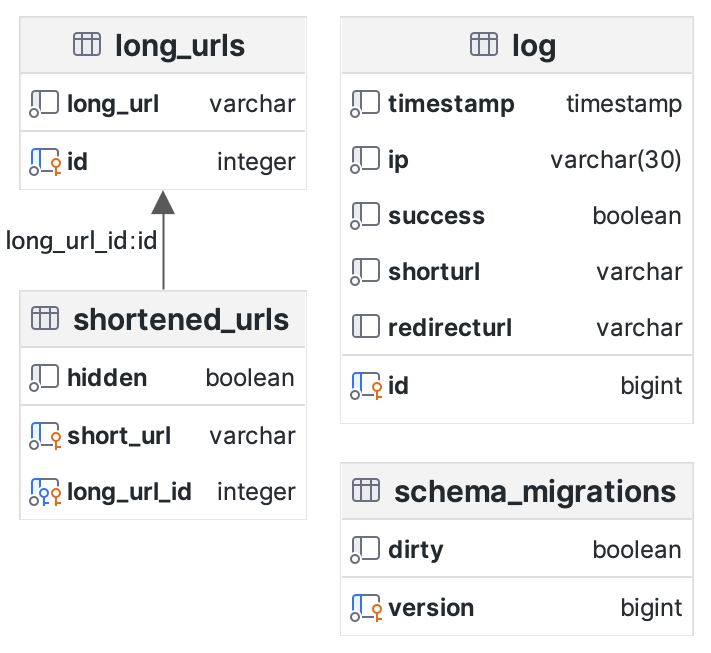

# Description
This is a simple url shortener written in Go.
- The short -> long URL mappings are stored in a PostgreSQL database.
- Requests are logged into the database.
- Files inside the `static/` folder can be served to the client.
---
**TOC**
<!-- TOC -->

- [Description](#description)
- [Installing and running](#installing-and-running)
    - [Docker](#docker)
- [Database schema](#database-schema)
- [Routes](#routes)
  - [1. Serving static files inside of the `static/public` folder](#1-serving-static-files-inside-of-the-staticpublic-folder)
  - [2. URL redirect](#2-url-redirect)
    - [2.5 Serving static files inside of the `static/private` folder](#25-serving-static-files-inside-of-the-staticprivate-folder)
- [IP logging feature](#ip-logging-feature)

<!-- /TOC -->
---

# Installing and running
### Docker
```
├── docker/
│   ├── docker-compose.yml
│   └── Dockerfile
├── migrations/
├── static/
├── ...
└── main.go
```
The project has a compose file for both development and production. 
| Service | Description |
|---|---|
| shortener-dev | The dev stack uses the [Air](https://github.com/cosmtrek/air) utility for hot reloading the backend when there is a change in the source code. | 
| postgres | Holds the URL mappings and the request logs |

```bash
cd docker && docker compose up
```


<!-- └── .gitignore -->


<!-- # Configuration -->
# Database schema


# Routes
Routes are enumerated based on the order in which they get matched against an incoming request.
## 1. Serving static files inside of the `static/public` folder
```
├── docker/
├── migrations/
├── static/
│   ├── public/
│   └── private/
├── ...
└── main.go
```
```
GET /public/*
```
Serves files inside the `static/public` folder.
## 2. URL redirect

This route checks the request URL for matching entries in the database. If a short -> long URL match is found, the client is redirected to the long URL.

### 2.5 Serving static files inside of the `static/private` folder
We may want to hide some files from being directly accessed in the `public` folder.\
The files inside the `static/private` folder can be accessed **only** by the URL redirect route.\
For example, to access the `Albert.vcf` file inside the `static/private` folder, we must have a short -> long URL mapping like the following:
`/contact -> /private/Albert.vcf`. The file cannot be directly accessed by requesting `GET /private/Albert.vcf`
<!-- - `GET /help`\
  Dumps the mapping in the answer -->


# IP logging feature
All the IPs making requests to the shortening service get logged inside the database.\
A friend of mine told me that it is basically spyware :see_no_evil:.\
I guess until no one complains its not illegal.